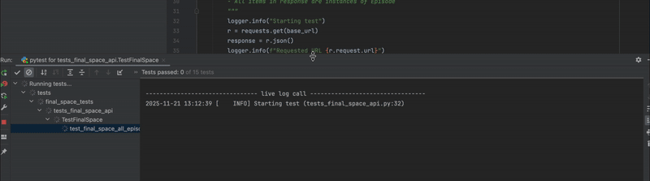

# API Automation Framework

A modular and scalable framework for automated API testing. It enables easy creation, organization, and execution of tests with a clear structure, reusable components, and a focus on stability, readability of results, and maintainability.

## Contents

* [Technologies](#technologies)
* [Project Structure](#project-structure)
* [Quick Start](#quick-start)
* [Writing Tests](#writing-tests)
* [Configuration](#configuration)

## Technologies

* Python
* pytest – testing framework
* requests – for HTTP requests

## Project Structure

```
/
├── test_config/           # configuration files (env variables, endpoints, etc.)
├── tests/                 # directory containing test files
│   ├── …                  # individual test files
├── pytest.ini             # pytest configuration
└── README.md              # this file
```

## Quick Start

1. Clone the repository:

```bash
git clone https://github.com/urosbmx/API_Automation_Framework.git
cd API_Automation_Framework
```

2. Create and activate a virtual environment:

```bash
python3 -m venv venv
source venv/bin/activate      # Unix/macOS
venv\Scripts\activate         # Windows
```

3. Install dependencies:

```bash
pip install -r requirements.txt
```

4. Configure the environment in `test_config/`.
5. Run tests:

```bash
pytest
```
6. Run test with markers:
```bash
pytest -m smoke_test_api
```

## Writing Tests

* Test files should be located in the `tests/` folder and start with the prefix `test_`.

* Use `pytest` markers to differentiate test groups if needed.

## Configuration

All environment variables (base URL, timeout, authentication) are located in the `test_config/` folder.

## 🎬 Demo GIF

